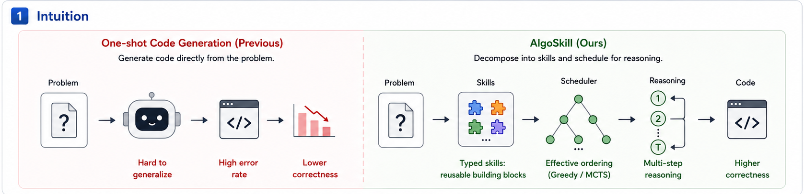
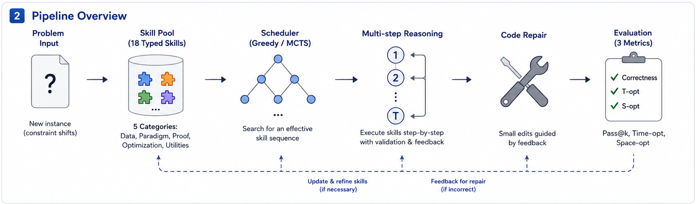

# AlgoSkill: Learning to Design Algorithms by Scheduling Human-Like Skills

<p align="center">
  <a href="https://arxiv.org/abs/2606.29999"></a>
  <a href="LICENSE"></a>
  <a href="requirements.txt"></a>
</p>

AlgoSkill is a framework for automatic algorithm design with large language models (LLMs). Instead of asking an LLM to solve an algorithmic problem in one prompt, AlgoSkill decomposes the design process into typed algorithmic skills and schedules these skills before code generation.

The repository includes the AlgoSkill framework, Direct and chain-of-thought (CoT) baselines, greedy and Monte Carlo tree search (MCTS) skill scheduling, execution-based verification, optional repair, time-optimality (T-opt) and space-optimality (S-opt) judging, benchmark data, ablations, and scripts for reproducing the main experiments.

<p align="center">
  
</p>

## At a Glance

- **Research question.** Can algorithm design be improved by scheduling reusable, human-like problem-solving skills?
- **Core idea.** AlgoSkill searches over typed algorithmic skill trajectories with greedy, MCTS, and verification-based variants.
- **What is included.** Benchmark data, direct and CoT baselines, skill schedulers, execution checks, repair, and T/S-optimality judging.

## Method Overview

Algorithm design usually requires several distinct decisions: reading constraints, selecting a useful abstraction, constructing a baseline, defining states or invariants, choosing a data structure, checking complexity, and converting the design into executable code. A one-shot prompt leaves these decisions implicit and gives the model little control over their order.

AlgoSkill represents these decisions as focused skill calls. A skill receives the problem and the current design plan, performs one reasoning operation, and returns an updated plan. The system then generates code from the accumulated plan and can repair the code when sample tests fail.

The framework supports two scheduling modes:

- **AlgoSkill-Greedy (`algoskill_g`)** uses a fixed compact design procedure that first selects an algorithmic family and then produces code.
- **AlgoSkill-MCTS (`algoskill_v3`)** explores multiple skill sequences, executes the resulting programs, and retains successful candidates. The number of sampled trajectories is controlled by `--n_traj`.

AlgoSkill is therefore a scaffolding and search framework around a fixed LLM backbone. It does not train or fine-tune the backbone.

<p align="center">
  
</p>

## Implemented Methods

| Method | Description |
|---|---|
| `direct` / `direct_v3` | One prompt directly generates the solution code. |
| `cot` / `cot_v3` | One-shot generation with a step-by-step reasoning instruction. |
| `algoskill_g` / `algoskill_g_v3` | Greedy skill-based algorithm selection followed by code generation. |
| `algoskill` / `algoskill_v3` | Multi-trajectory AlgoSkill with MCTS-style search over skill sequences. |
| `reflexion` / `reflexion_v3` | Generates a solution and reflects on execution failures before revision. |
| `selfrefine` / `selfrefine_v3` | Critiques and revises the generated solution. |
| Beam and no-policy variants | Search ablations implemented in `src/ablations.py` and `src/run_mcts_ablation_v2.py`. |

## Typed algorithmic skills

The skill library is defined in `src/skills.py`. It contains focused prompts for operations such as:

- constraint reading and input-scale analysis;
- problem abstraction and analogy mapping;
- brute-force baseline construction;
- state, recurrence, invariant, and transition design;
- graph, dynamic programming, greedy, search, and data-structure reasoning;
- complexity analysis and refinement;
- adversarial case analysis;
- implementation planning and final code generation.

A trajectory is an ordered composition of these skills. Different trajectories can lead the same backbone to different abstractions, algorithms, and implementations.

## Evaluation flow

For each problem, the runner performs the following steps:

1. Load the statement, constraints, tests, and known asymptotic targets.
2. Run the selected baseline or AlgoSkill scheduler.
3. Extract executable Python code from the model output.
4. Execute the program under a timeout and compare normalized outputs.
5. For multi-trajectory settings, compute `pass@1`, `pass@k`, and the best number of passed tests.
6. Optionally invoke a repair step on failed tests.
7. Apply the LLM judge to estimate T-opt and S-opt relative to the known reference complexities.
8. Record correctness, code, token use, latency, and judge outputs in JSON.

T-opt measures whether the submitted program matches the expected asymptotic time complexity. S-opt applies the same idea to auxiliary space complexity. These metrics supplement execution correctness; they do not replace it.

## Benchmarks

The release supports three evaluation settings.

### Hard Bench (HB-15)

`data/hard_bench_corpus.json` contains 15 hand-written paraphrases of canonical algorithmic problems. Each problem uses standard-input and standard-output evaluation with multiple tests. This setting is used for multi-sample `pass@k`, T-opt, and S-opt analysis.

### v4-192

`data/rule_based_corpus_v4.json` contains 192 procedurally generated problems grouped by canonical algorithmic family. Each instance includes its expected output and known optimal time and space complexity. This corpus is used for the main controlled comparison across methods and backbones.

### Post-cutoff AtCoder problems

The paper also evaluates on AtCoder ABC problems released after August 1, 2024. These statements are not redistributed in this repository. A locally rebuilt corpus can be evaluated with `src/run_multitest.py` and judged with `src/run_topt_judge_hb_v3.py`.

The post-cutoff evaluation is important because gains on synthetic or canonical distributions may not transfer at the same scale to newly released contest problems.

## Key empirical observations

The current README reports the main observations from the paper rather than treating every setting as equally favorable:

- On Hard Bench with one API backend, AlgoSkill-MCTS improves correctness over Direct by 26.7 percentage points, from 3/15 to 7/15.
- On v4-192 with a stronger API backend, AlgoSkill improves correctness by 20.3 percentage points and T-opt by 19.8 percentage points over Direct.
- On the 48 post-cutoff AtCoder problems, the synthetic-corpus gains do not transfer at the same magnitude. Some backbone and metric combinations show no gain or a correctness–efficiency trade-off.
- On reasoning-heavy backbones, AlgoSkill-MCTS can be expensive because each trajectory contains several long LLM calls. In these settings, the per-call reasoning latency can dominate the MCTS trajectory count.

These results support a measured interpretation: explicit skill scheduling can improve algorithm design, but its value depends on the backbone, problem distribution, search budget, and evaluation metric.

## Repository structure

```text
algorithm_skill/
├── README.md
├── LICENSE
├── requirements.txt
├── assets/
│   ├── algoskill_intuition.png
│   └── algoskill_pipeline.png
├── data/
│   ├── hard_bench_corpus.json
│   └── rule_based_corpus_v4.json
├── scripts/
│   ├── reproduce_hardbench.sh
│   ├── reproduce_postcutoff.sh
│   └── reproduce_v4.sh
└── src/
    ├── algoskill.py
    ├── skills.py
    ├── ablations.py
    ├── verifier.py
    ├── llm_client.py
    ├── problems.py
    ├── run_rule_based.py
    ├── run_multitest.py
    ├── run_hard_v3_unified.py
    ├── run_hard_benchmark.py
    ├── run_mcts_ablation_v2.py
    ├── run_skill_frequency.py
    ├── run_topt_judge.py
    ├── run_topt_judge_hb_v3.py
    ├── run_topt_judge_t6_v3.py
    ├── rule_based_corpus_v4.py
    └── cross_platform_corpus_v2.py
```

## Installation

```bash
git clone https://github.com/Hik289/algorithm_skill.git
cd algorithm_skill
python3 -m venv .venv
source .venv/bin/activate
pip install --upgrade pip
pip install -r requirements.txt
```

The release is intended for Python 3.10–3.12.

## API configuration

The code uses generic backend aliases (`default`, `fast`, `strong`, and
`judge`). Concrete providers, model identifiers, endpoints, and keys are local
configuration and are not hard-coded in the repository.

For a single backend, set:

```bash
export ALGOSKILL_API_STYLE="chat_completions"
export ALGOSKILL_BASE_URL="https://your-compatible-endpoint/v1"
export ALGOSKILL_MODEL="your-model-id"
export ALGOSKILL_API_KEY="..."
```

For multiple aliases, use alias-specific variables:

```bash
export ALGOSKILL_DEFAULT_API_STYLE="chat_completions"
export ALGOSKILL_DEFAULT_BASE_URL="https://your-default-endpoint/v1"
export ALGOSKILL_DEFAULT_MODEL="your-default-model"
export ALGOSKILL_DEFAULT_API_KEY="..."

export ALGOSKILL_JUDGE_API_STYLE="chat_completions"
export ALGOSKILL_JUDGE_BASE_URL="https://your-judge-endpoint/v1"
export ALGOSKILL_JUDGE_MODEL="your-judge-model"
export ALGOSKILL_JUDGE_API_KEY="..."
```

Alternatively, copy `backend_config.example.json` to a local untracked file and
point `ALGOSKILL_BACKEND_CONFIG` to it. The JSON keys are backend aliases and
the values contain `api_style`, `model`, `base_url`, `api_key_env`, and optional
`sleep_after` or `default_max_output_tokens`. Supported API styles are
`chat_completions`, `responses`, `messages`, `generate_content`, and `converse`.

`src/llm_client.py` stops after repeated fatal API failures so that an invalid
key or exhausted quota does not silently continue consuming experiment time.

## Quick start

### Direct generation on three v4-192 problems

```bash
python src/run_rule_based.py \
  --corpus data/rule_based_corpus_v4.json \
  --method direct \
  --backbone default \
  --out results/smoke_direct.json \
  --limit 3
```

### AlgoSkill-Greedy on Hard Bench

```bash
python src/run_hard_v3_unified.py \
  --method algoskill_g_v3 \
  --backbone strong \
  --out results/hb_algoskill_g_strong.json
```

### AlgoSkill-MCTS with ten trajectories

```bash
python src/run_hard_v3_unified.py \
  --method algoskill_v3 \
  --backbone default \
  --n_traj 10 \
  --out results/hb_algoskill_mcts.json
```

### T-opt and S-opt judging

```bash
python src/run_topt_judge_hb_v3.py \
  --results results/hb_algoskill_g_strong.json \
  --corpus data/hard_bench_corpus.json \
  --judge_backbone judge \
  --out results/hb_algoskill_g_strong_judged.json
```

## Output format

A typical result entry has the following structure:

```json
{
  "problem_id": {
    "correct": true,
    "pass_at_1": false,
    "pass_at_k": true,
    "best_passed": 4,
    "total_tests": 5,
    "code": "<generated program>",
    "tokens": {
      "prompt_tokens": 0,
      "completion_tokens": 0,
      "total_tokens": 0
    },
    "elapsed": 12.7
  }
}
```

Judged files additionally contain T-opt and S-opt decisions and parsed reference and submitted complexities.

## Reproducing the paper results

| Experiment | Command |
|---|---|
| v4-192 correctness, T-opt, and S-opt | `bash scripts/reproduce_v4.sh` |
| HB-15 pass@k, T-opt, and S-opt | `bash scripts/reproduce_hardbench.sh` |
| Post-cutoff distribution shift | `bash scripts/reproduce_postcutoff.sh` after rebuilding the corpus |
| MCTS search ablations | `python src/run_mcts_ablation_v2.py --backbone default --out results/mcts_ablation.json` |
| Skill-frequency analysis | `python src/run_skill_frequency.py --backbone default --out results/skill_frequency.json` |

The reproduction scripts write new experiment outputs under `results/`. The full original raw result directory is not included because reproducing all backbone–corpus combinations requires paid API calls.

## Cost and latency notes

AlgoSkill-MCTS makes several LLM calls per trajectory and may also call the model for repair. Cost and latency therefore grow with the number of trajectories, skill depth, backbone reasoning behavior, and output-token budget.

`run_hard_v3_unified.py` exposes `--n_traj` to control the number of AlgoSkill trajectories. Lowering this value reduces the number of sampled trajectories, but it does not remove high per-call latency from reasoning-focused backbones. For resource-limited experiments, AlgoSkill-Greedy is the lower-cost option.

## Limitations

AlgoSkill depends on the quality of the skill library and the scheduler. A missing skill or poor skill order can still produce an incorrect design. Execution-based verification is limited by test coverage, and the optional repair step may overfit visible sample failures. T-opt and S-opt are estimated by an LLM judge and should be interpreted together with execution results and manual checks. Finally, gains on canonical or generated problems should not be assumed to transfer unchanged to newly released contest problems.

## Reviewer Guide

For a reviewer-oriented map of smoke checks, paper-scale entry points, data boundaries, and reporting metadata, see [Artifact Guide](docs/ARTIFACT.md).

## Artifact Checklist

- **Code release.** Core implementations, configuration files, and reproduction entry points are versioned in this repository.
- **Reproducibility.** Start with the smoke or quick-start path before paper-scale runs; record the commit hash, Python version, backend/model identifiers, seeds, and command-line arguments.
- **Data and credentials.** Large datasets, benchmark downloads, generated outputs, and API keys are intentionally excluded. Use the data and configuration notes above to recreate them or point to local copies.
- **Reporting.** For paper-scale runs, keep raw run folders immutable and regenerate tables or figures from the logged artifacts with the listed analysis scripts.

## Citation

```bibtex
@misc{song2026algoskill,
  title         = {AlgoSkill: Learning to Design Algorithms by Scheduling Human-Like Skills},
  author        = {Xinyuan Song and Zekun Cai and Liang Zhao},
  year          = {2026},
  eprint        = {2606.29999},
  archivePrefix = {arXiv},
  primaryClass  = {cs.AI},
  doi           = {10.48550/arXiv.2606.29999},
  url           = {https://arxiv.org/abs/2606.29999}
}
```

## License

This project is released under the MIT License. See `LICENSE`.
